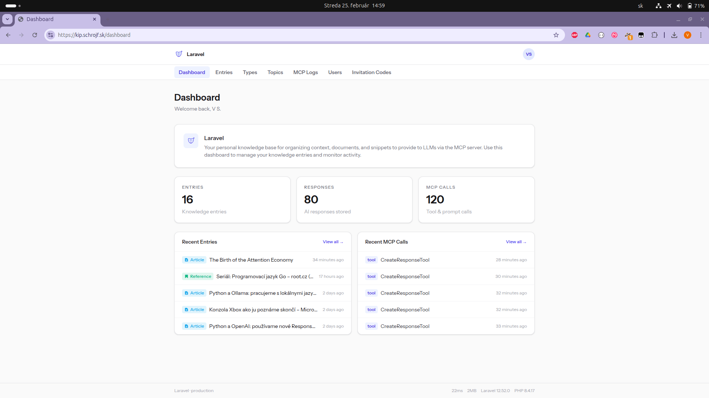
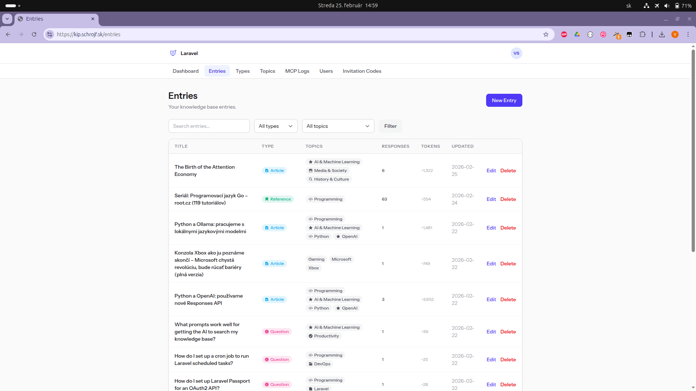
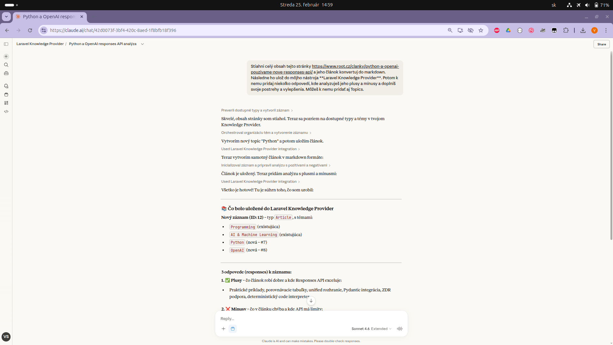
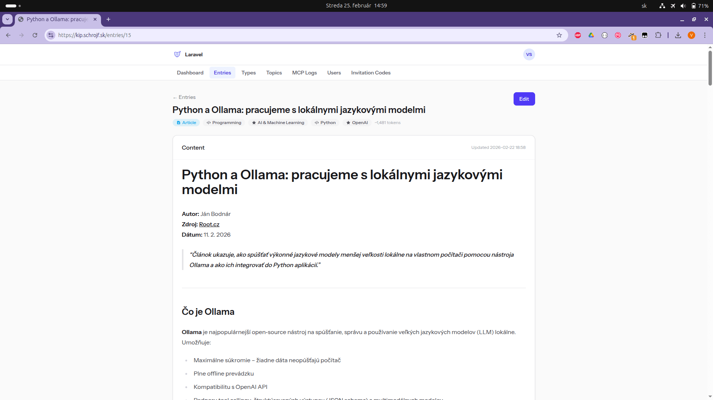
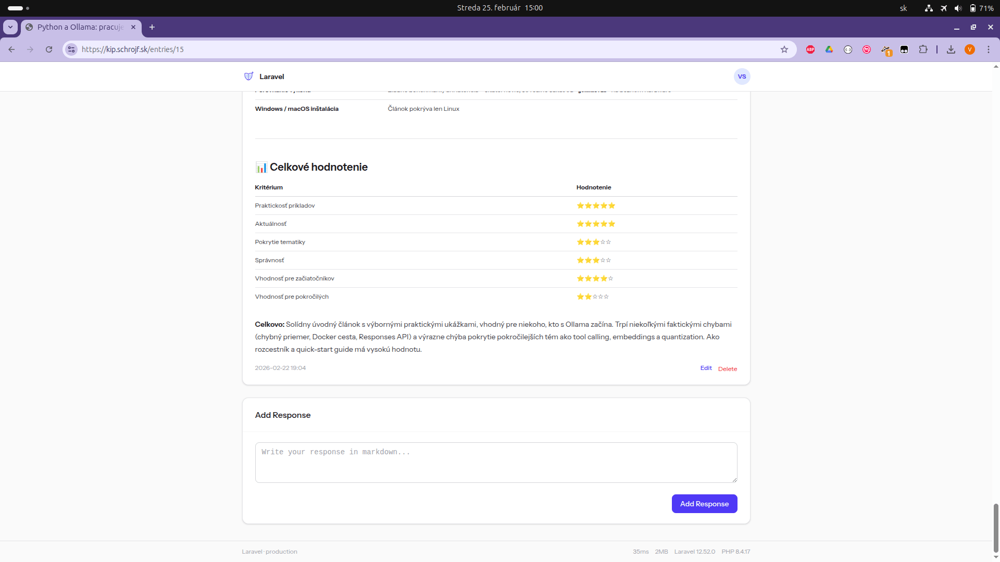
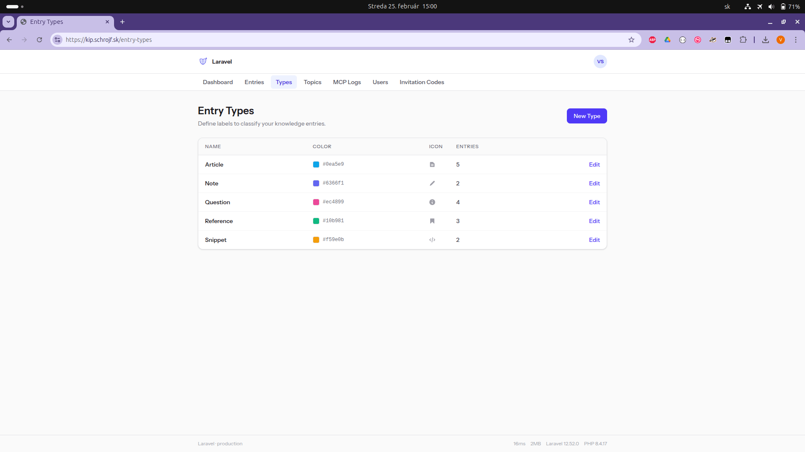
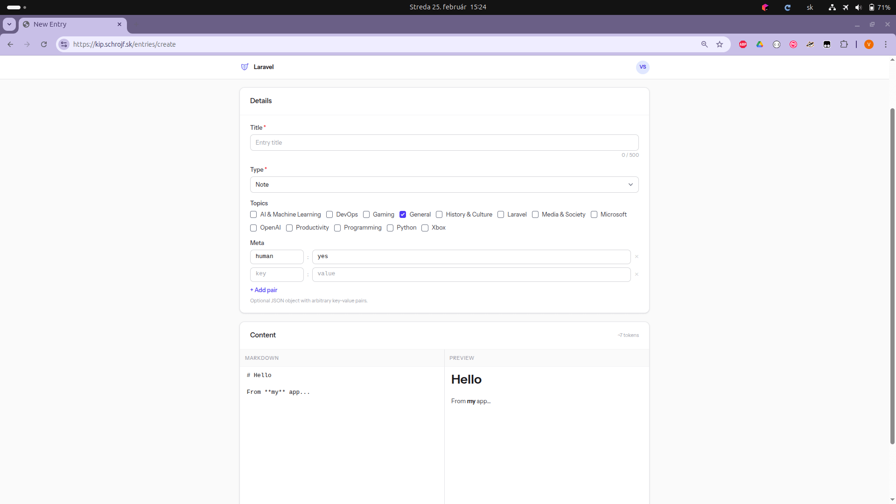
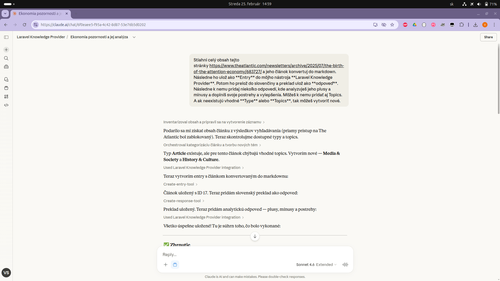
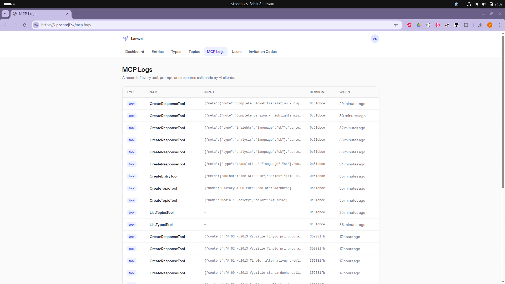
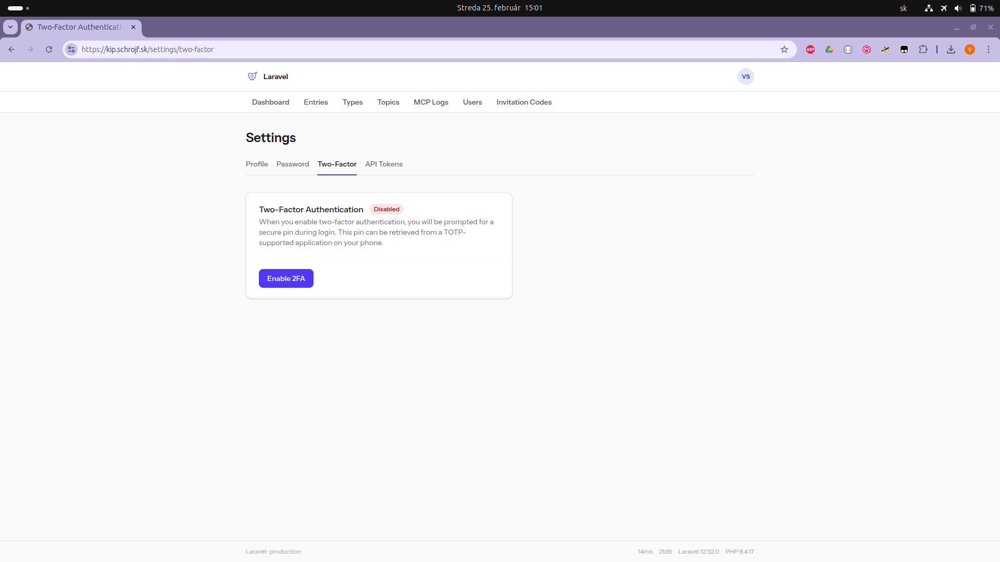

# laravel-simple-rag — Laravel Knowledge Provider

A self-hosted, single-user knowledge manager and MCP server built on [Laravel MCP](https://github.com/laravel/mcp). Organise your snippets, questions, documents, and context in a web UI, then expose everything to AI assistants (Claude, etc.) via the Model Context Protocol. LLMs can read your knowledge base and write answers, scraped content, and summaries back into it.



---

## Table of Contents

- [Features](#features)
- [Requirements](#requirements)
- [Installation](#installation)
- [Configuration](#configuration)
- [First-Time Setup](#first-time-setup)
- [Using the Web UI](#using-the-web-ui)
- [MCP Server](#mcp-server)
    - [Authentication (OAuth2)](#authentication-oauth2)
    - [Registering with Claude Desktop](#registering-with-claude-desktop)
    - [Available Tools](#available-tools)
    - [Available Prompts](#available-prompts)
    - [Available Resources](#available-resources)
- [Key Use Cases](#key-use-cases)
- [Development](#development)

---

## Features

- **Web Knowledge Manager** — CRUD UI for entries (markdown), entry types, topics, and responses
- **MCP Server** — exposes all content to LLMs via the Model Context Protocol over OAuth2
- **Live Markdown editor** — write and preview markdown side-by-side in the browser
- **Response management** — add and edit responses on separate pages or inline on the entry view
- **Meta key-value pairs** — attach arbitrary metadata (e.g. `source_url`, `model_name`) to entries and responses via an interactive key-value editor; LLMs can write metadata too
- **Icons for entry types and topics** — assign one of 25 curated SVG icons to categorise your knowledge visually; icons appear in tables, entry badges, and the dashboard
- **Personal access tokens** — create and manage long-lived API tokens in **Settings → API Tokens** for scripted or direct API access
- **Full-text search** — entry search uses native full-text indexes on MySQL/MariaDB/PostgreSQL, with automatic LIKE fallback on SQLite
- **Invitation-based registration** — controlled access via invite codes (optional, see [Configuration](#configuration))
- **Fully self-hosted** — no external dependencies beyond your own server

---

## Screenshots

<details>

<summary>Show all screenshots</summary>











</details>

---

## Requirements

- PHP 8.4+
- Composer
- Node.js & npm
- SQLite, MySQL, or PostgreSQL
- (Optional) Redis for queue/cache

---

## Installation

```bash
# 1. Clone and install dependencies
git clone https://github.com/your-username/laravel-simple-rag.git
cd laravel-simple-rag
composer install
npm install

# 2. Environment setup
cp .env.example .env
php artisan key:generate

# 3. Configure your database in .env, then run migrations
php artisan migrate

# 4. Generate Passport OAuth2 keys (required for MCP auth)
php artisan passport:keys

# 5. Build frontend assets
npm run build

# 6. Start the development server
composer run dev
```

> For production, deploy with Laravel Forge or any standard Laravel hosting. Run `npm run build` instead of `npm run dev`.

---

## Configuration

The following custom environment variables control application behaviour. Set them in your `.env` file.

| Variable                   | Default | Description                                                                                                      |
| -------------------------- | ------- | ---------------------------------------------------------------------------------------------------------------- |
| `APP_REQUIRE_INVITATION`   | `false` | When `true`, registration requires a valid invitation code. When `false`, anyone can register.                   |
| `APP_SEED_DEFAULT_CONTENT` | `true`  | When `true`, a set of default entry types and topics is seeded on fresh installs. Set to `false` to start blank. |
| `APP_SHOW_LANDING_DETAILS` | `false` | When `true`, extra detail (feature list, MCP info) is shown on the public landing page.                          |

---

## First-Time Setup

### 1. Register your account

If `APP_REQUIRE_INVITATION` is `false` (default), open your app URL and register directly.

If invitations are required, first generate an invitation code on the server:

```bash
php artisan invitation:manage create --description="my account"
```

Then open your app URL and register using the code.

### 2. List or deactivate invitation codes

```bash
php artisan invitation:manage list
php artisan invitation:manage deactivate --code=YOUR_CODE
```

### 3. (Optional) Enable personal access tokens

If you want to use **Settings → API Tokens** to create long-lived tokens for scripted API access, create the Passport personal access client once:

```bash
php artisan passport:client --personal --no-interaction
```

### 4. Set up your entry types

After logging in, go to **Entry Types** and create the types you want to use (e.g. `question`, `snippet`, `document`, `context`). Entry types are how you and the LLM categorize knowledge.

### 5. (Optional) Create topics

Go to **Topics** and create topic tags (e.g. `Programming`, `Personal`, `Work`) to organise entries across types.

---

## Using the Web UI

| Page          | URL                                  | Description                               |
| ------------- | ------------------------------------ | ----------------------------------------- |
| Dashboard     | `/dashboard`                         | Overview of your knowledge base           |
| Entries       | `/entries`                           | Browse, filter, and search all entries    |
| New Entry     | `/entries/create`                    | Create an entry with the Markdown editor  |
| Edit Entry    | `/entries/{id}/edit`                 | Edit content, meta, and manage responses  |
| New Response  | `/entries/{id}/responses/create`     | Add a response with the Markdown editor   |
| Edit Response | `/entries/{id}/responses/{rid}/edit` | Edit a response's content and meta        |
| Entry Types   | `/entry-types`                       | Manage your entry type labels and icons   |
| Topics        | `/topics`                            | Manage your topic tags and icons          |
| Settings      | `/settings/profile`                  | Profile, password, two-factor, API tokens |

**Entries** are the core unit — a title, Markdown content, a type, and optional topics. **Responses** are attached to entries and represent answers or generated content (written by you or by an LLM via MCP).

Both entries and responses support optional **meta** key-value pairs — arbitrary data attached to the record (e.g. `source_url`, `model_name`, `confidence`). The UI provides an interactive key-value editor; LLMs can supply meta via the MCP tools.

---

## MCP Server

The RAG MCP server is available at `/mcp/rag` and is protected by Laravel Passport OAuth2.

### Authentication (OAuth2)

The MCP server uses the standard OAuth2 flow. MCP clients (like Claude Desktop) handle authentication automatically once registered.

To verify your server is working, use the built-in inspector:

```bash
# Test the RAG server interactively
php artisan mcp:inspector rag
```

This launches the MCP Inspector and prints the client configuration to copy into your MCP client.

### Registering with Claude Desktop

Add the following to your Claude Desktop MCP configuration (`claude_desktop_config.json`):

```json
{
    "mcpServers": {
        "knowledge-base": {
            "command": "npx",
            "args": ["mcp-remote", "https://your-app-url.com/mcp/rag"]
        }
    }
}
```

Replace `https://your-app-url.com` with your actual app URL. On first connection, Claude Desktop will open a browser window to complete the OAuth2 authorization — approve it to grant access.

> **Local development:** Run `php artisan mcp:inspector rag` for the exact configuration to use. The local `rag` server is also registered for stdio-based testing.

> **HTTPS note:** Many AI agents run on Node.js, which uses its own certificate store. Self-signed or local certificates may cause connection failures. For local testing, prefer plain `http://`; use `https://` on production with a valid certificate.

### Available Tools

All tools are scoped to your authenticated account.

| Tool              | Description                                                                                                                                                                |
| ----------------- | -------------------------------------------------------------------------------------------------------------------------------------------------------------------------- |
| `search_entries`  | Search entries by keyword, type ID, topic ID, and/or `without_responses` flag. Returns previews with `responses_count` and metadata. Optional `limit` (1–100, default 20). |
| `get_entry`       | Fetch a single entry by ID. Pass `with_responses: true` to include all attached responses.                                                                                 |
| `get_responses`   | List all responses stored for a given entry ID.                                                                                                                            |
| `list_types`      | List all your entry types with their IDs. Call this before creating entries.                                                                                               |
| `list_topics`     | List all your topics with their IDs. Call this before tagging entries.                                                                                                     |
| `create_entry`    | Create a new entry. Requires `title`, `content` (Markdown), and `type_id`. Optionally pass `topic_ids` and `meta` (key-value object).                                      |
| `create_response` | Store a response linked to an entry. Requires `entry_id` and `content`. Optionally pass `meta` (key-value object).                                                         |
| `create_topic`    | Create a new topic tag. Requires `name`. Optional `color` and `icon`.                                                                                                      |
| `add_topic`       | Attach an existing topic to an existing entry. Requires `entry_id` and `topic_id`.                                                                                         |

### Available Prompts

Prompts are reusable instruction templates that guide the LLM through multi-step workflows using the tools above.

#### `answer_question`

Finds an unanswered question entry matching a query and stores an answer as a response.

**Argument:** `query` (required) — topic or keywords to search for

**Workflow the LLM follows:**

1. Calls `search_entries` with the query keyword
2. Identifies entries that look like unanswered questions
3. Calls `get_entry` with `with_responses: true` to check for existing answers
4. Composes a thorough Markdown answer
5. Calls `create_response` to store it

#### `scrape_and_store`

Fetches a URL, extracts the meaningful content, and stores it as a new entry.

**Arguments:**

- `url` (required) — the page to fetch
- `type_id` (optional) — entry type to use; if omitted, the LLM calls `list_types` first

**Workflow the LLM follows:**

1. Fetches the URL content
2. Extracts title and body (skips navigation, ads, footers)
3. Formats as clean Markdown
4. Calls `create_entry` to store it

### Available Resources

| Resource | URI Template           | Description                                                                   |
| -------- | ---------------------- | ----------------------------------------------------------------------------- |
| Entry    | `entry://entries/{id}` | Returns the full Markdown content of an entry, including its type and topics. |

---

## Key Use Cases

### Q&A Flow

1. Create an entry with type `question` and your question as the title/content.
2. Ask your AI assistant to use the `answer_question` prompt with a matching keyword.
3. The LLM searches for the question, writes an answer, and stores it as a response.
4. Review and edit the response in the web UI.

### Web Scraping Flow

1. Tell your AI assistant to use the `scrape_and_store` prompt with a URL.
2. The LLM fetches the page, converts it to Markdown, and creates an entry.
3. The entry appears in your knowledge base immediately.

### Knowledge Retrieval

- Use `search_entries` with keywords or type/topic filters to find relevant context.
- Use `get_entry` with `with_responses: true` to pull a complete entry with all its stored answers.
- Access any entry directly via the `entry://entries/{id}` resource URI.

---

## Development

```bash
# Run the development server (Vite + PHP server + queue worker)
composer run dev

# Run tests
php artisan test --compact

# Test the RAG MCP server interactively
php artisan mcp:inspector rag

# Format PHP code
vendor/bin/pint

# Run static analysis
vendor/bin/phpstan analyse
```

### User management

```bash
php artisan user:manage list
php artisan user:manage promote --email=user@example.com
php artisan user:manage demote  --email=user@example.com
```

Run `php artisan user:manage --help` for full usage.

### Invitation management

```bash
php artisan invitation:manage create [--description=] [--count=]
php artisan invitation:manage list
php artisan invitation:manage deactivate --code=CODE
```
